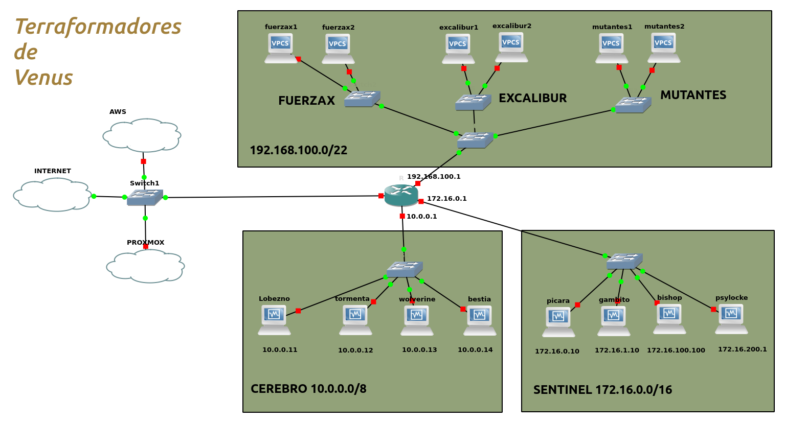

**¡Bienvenidos al Desafío Empresarial de Terraformadores de Venus!** 

  

Terraformadores de Venus, fundada por los visionarios **Stan Lee** y **Jack Kirby**, es una empresa emergente que está revolucionando el mundo de la infraestructura tecnológica. Con sede en la vibrante ciudad de **Paiporta**, Terraformadores de Venus se especializa en ofrecer a empresas de todos los tamaños la capacidad de alojar, gestionar y desplegar sus aplicaciones y servicios en una variedad de entornos, incluyendo servidores propios, la nube pública de AWS, y su exclusiva nube privada, **NimbusNet**. 

  

Stan y Jack, apasionados por las tecnologías disruptivas y el servicio al cliente, han construido Terraformadores de Venus con la misión de proporcionar soluciones flexibles, seguras y escalables que se adapten a las necesidades cambiantes de sus clientes. Desde startups tecnológicas hasta grandes corporaciones, la empresa está posicionada como un socio confiable que permite a sus clientes concentrarse en lo que mejor saben hacer, mientras Terraformadores se encarga del resto. 
 

Actualmente trabajamos un equipo multidisciplinar formado por:    
1. Charles Xavier (Profesor X): Serguro y con altas capaciades.
2. Jean Grey (Marvel Girl): Telepática y telequinética además de distribuir BBDD.
3. Beast/Dr.Strange/Vision: Superfuerza, agilidad y facilidad para desplegar todo tipo de artefactos. Maestros de la lógica y de los lenguajes de programación. Digitalizadores en sus ratos libres.
4. Angel (Warren Worthington III): ASO y Sostenibilidad 
5. Iceman (Bobby Drake): Capacidad para generar y manipular hielo, además de distribir información y bautizar todo tipo de dispositivo.
 

En esta empresa vais a tener la oportunidad de trabajar directamente con Terraformadores de Venus en el desarrollo de propuestas y soluciones innovadoras que ayuden a la empresa a mejorar sus servicios y expandir su presencia en el mercado. 
 

En este trabajo trabajaréis en equipo y de manera colaborativa bajo, el equipo proporcionará retroalimentación y orientación para garantizar que las soluciones propuestas sean tanto innovadoras como prácticas. 
 
 

¡Preparen sus mentes! Este es su momento de brillar en el dinámico y desafiante mundo de la computación en la nube con Terraformadores de Venus.
 
   
  
 
Aquí podéis conocer como nos infraestructuramos
 
   

