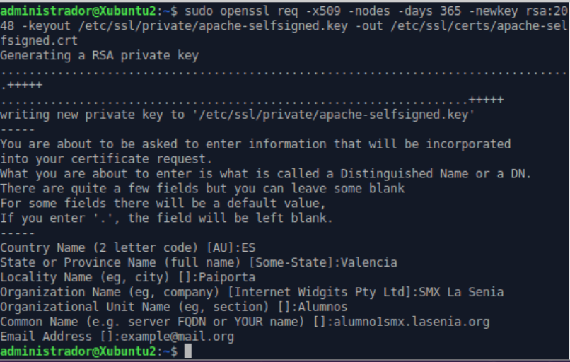
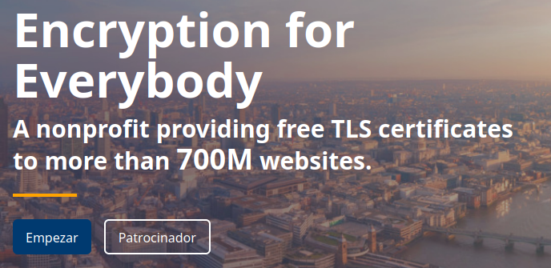
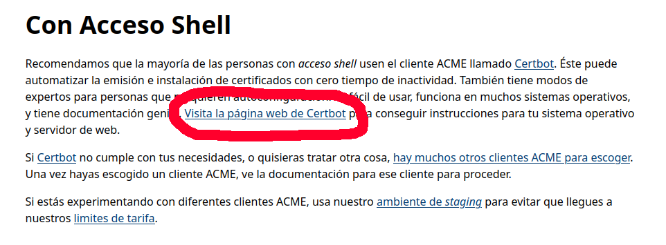
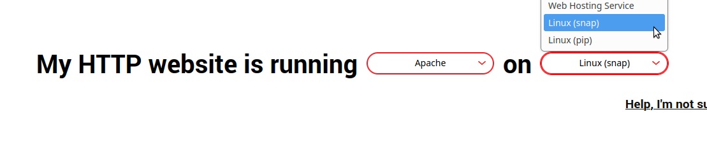

# UD2 – Criptografía

## Tarea 4: Certificados SSL

Vamos a crear un certificado autofirmado SSL, es decir, para instalar en un servidor web. Usaremos el formato X.509. Una vez creado lo subiremos a Aules.

Cuando decimos autofirmado significa que no va a estar firmado por una autoridad certificadora (CA) por lo que, si lo instalamos en un servidor web, aparecerá una advertencia indicando eso precisamente. Más adelante veremos cómo crear certificados firmados por una CA gratuita para poder usar en nuestros servidores web sin que aparezca dicha advertencia.

Para crear certificados SSL en formato X.509 autofirmados podemos utilizar la herramienta OpenSSL. Esta herramienta nos genera, por un lado, el certificado y, por otro lado, la clave privada que se quedará en el servidor web. La clave privada se utiliza para cifrar el contenido que se envía a los clientes mientras que el certificado SSL se comparte de forma pública con cualquiera que solicite el contenido. Así, puede descifrarse dicho contenido firmado con la clave privada.

Simplemente tenemos que utilizar el comando openssl con una serie de parámetros:

```
sudo openssl req -x509 -nodes -days 365 -newkey rsa:2048   -keyout /etc/ssl/private/apache-selfsigned.key -out /etc/ssl/certs/apache-selfsigned.crt
```

{width=12cm}

A continuación explicamos los parámetros utilizados:

**req** –> especifica que vamos a hacer una solicitud de firma de certificados (CSR)

**-x509** –> modifica el parámetro anterior especificando que vamos a crear un certificado autofirmado en vez de hacer únicamente la solicitud de firma

**-nodes** –> especifica que no vamos a poner una contraseña al certificado. Si usásemos una contraseña, cada vez que se inciara el servicio web se necesitaría poner a mano la contraseña.

**-days 365** –> indica el tiempo durante el cual se considerará válido el certificado

**-newkey rsa:2048** –> con este parámetro indicamos que, aparte del certificado, vamos a generar al mismo tiempo una clave. La segunda parte del parámetro indica el algoritmo de cifrado y los bits con los que vamos a generar dicha clave. En este caso RSA y 2048 bits.

**-keyout** –> la ruta que pongamos a continuación será el fichero donde se almacene la clave privada que hemos creado

**-out** –> la ruta que pongamos a continuación será el fichero donde se almacene el certificado que hemos creado

Cuando ejecutemos el comando, nos preguntará una serie de datos para incluir en el certificado. Es especialmente importante el campo “Common Name” ya que debe coincidir con el nombre de dominio a través del cuál vamos a acceder al servidor web. Si no coincide, el certificado mostrará un error cuando accedamos desde un navegador.

Con esto ya tendríamos generados los ficheros **.key** y **.crt** que habría que configurar en el fichero de configuración del servidor web

**Certificados auto-renovables con Let’s Encrypt y certbot.**

Let’s encrypt es una Autoridad de Certificación que proporciona certificados confiables para todo aquel que tenga un nombre de dominio. 

Aunque no podemos tener actualmente un nombre de dominio, vamos a ver cómo tendríamos que configurar nuestro servidor para un caso futuro.

Lo primero que debemos hacer es entrar en la web de Let’s Encrypt: https://letsencrypt.org/


Una vez dentro, pulsaremos sobre el botón de *Empezar*.

{width=10cm}

Llegaremos a una página donde nos da varias opciones, dependiendo de si tenemos acceso al shell de nuestro servidor web o no. Vamos a simular que estamos trabajando con el servidor Apache que hemos configurado, así que como sí que tenemos acceso a la shell pulsaremos en el apartado correspondiente que nos llevará a la página de *certbot*.



Allí seleccionaremos las opciones de nuestro servidor y nos redirigirá a unas instrucciones precisas que simplemente tendremos que seguir para dejar nuestro sistema configurado.

{width=10cm}
