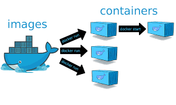
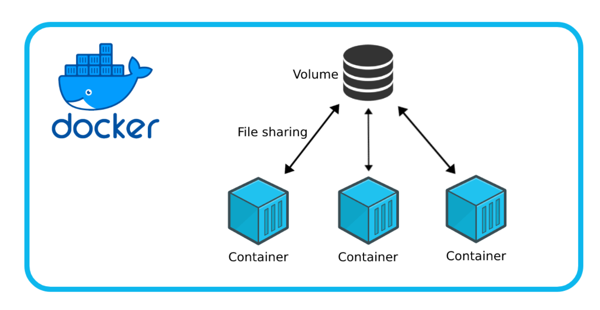

# 📘 Dossier de Docker: Imágenes, Volúmenes, Docker Compose y Redes

**Módulo:** Administración de Sistemas Informáticos en Red (ASIR)
**Tema:** Docker (Imágenes, Volúmenes, Orquestación con Compose y Redes)

---

## 1. 🐳 Imágenes con Dockerfile

Una **imagen** en Docker es una **plantilla inmutable** que contiene todo lo necesario para ejecutar una aplicación (sistema base, librerías, dependencias, configuraciones, código).
Un **contenedor** es una instancia **en ejecución** de esa imagen.




### 📌 Instrucciones principales de un Dockerfile

* **FROM** → Define la imagen base.
* **RUN** → Ejecuta comandos durante la construcción.
* **COPY / ADD** → Copia archivos al contenedor.
* **WORKDIR** → Establece el directorio de trabajo.
* **EXPOSE** → Informa del puerto que se usará.
* **CMD / ENTRYPOINT** → Comando por defecto al iniciar.
* **ENV** → Variables de entorno.
* **VOLUME** → Define un volumen persistente.


---

### 📌 Ejemplo

```dockerfile
FROM debian:latest
RUN apt-get update && apt-get install -y nginx
COPY index.html /var/www/html/index.html
WORKDIR /var/www/html
EXPOSE 80
CMD ["nginx", "-g", "daemon off;"]
```

```bash
docker build -t miweb:v1 .
docker run -d -p 8080:80 miweb:v1
```

👉 Hemos creado un **servidor web personalizado con Nginx**.

---

## 2. 📂 Volúmenes en Docker

Un **volumen** en Docker es un mecanismo para **persistir datos** fuera del ciclo de vida del contenedor.

* Si borramos el contenedor, los datos siguen existiendo.
* Permite compartir datos entre contenedores.
* Se almacena en el host (gestionado por Docker o definido manualmente).





---

### 📌 Tipos de volúmenes

1. **Volúmenes nombrados**

   * Docker los gestiona automáticamente.
   * Se almacenan en `/var/lib/docker/volumes/`.
   * Ejemplo:

     ```bash
     docker volume create datos_web
     docker run -d -v datos_web:/usr/share/nginx/html nginx
     ```

2. **Bind Mounts**

   * Se enlaza un directorio específico del host al contenedor.
   * Los cambios en el host se reflejan inmediatamente en el contenedor.
   * Ejemplo:

     ```bash
     docker run -d -v $(pwd)/pagina:/usr/share/nginx/html nginx
     ```

📌 **Comparación visual:**

```
Volumen nombrado:
 [ Host (/var/lib/docker/volumes/datos_web) ] <---> [ Contenedor (/var/www/html) ]

Bind Mount:
 [ Host (/home/user/pagina) ] <---> [ Contenedor (/usr/share/nginx/html) ]
```

---

### 📌 Comandos útiles de volúmenes

```bash
docker volume ls              # Listar volúmenes
docker volume inspect datos_web   # Ver detalles
docker volume rm datos_web    # Eliminar un volumen
```

---

## 3. 📦 Docker Compose

### 📌 ¿Qué es Docker Compose?

Es una herramienta de **orquestación ligera** que permite definir y ejecutar múltiples contenedores con un solo archivo (`docker-compose.yml`).

Ventajas principales:

* Definir servicios, redes y volúmenes en un único fichero.
* Levantar y detener todo un entorno con un solo comando.
* Evita tener que escribir largos `docker run ...`.
* Permite reproducir entornos fácilmente en distintos equipos.

📌 **Esquema conceptual:**

```
docker-compose.yml
   ├── Servicio A (Nginx)
   ├── Servicio B (Alpine con cliente curl/ping)
   └── Red compartida entre ambos
```

---

### 📌 Ejemplo básico de Docker Compose

Archivo `docker-compose.yml`:

```yaml
version: "3.8"

services:
  web:
    image: nginx:latest
    ports:
      - "8080:80"
    networks:
      - terraformadores

  cliente:
    image: alpine
    command: ping web
    networks:
      - terraformadores

networks:
  terraformadores:
```

👉 En este ejemplo:

* Se levanta un servicio **Nginx** expuesto en el puerto `8080`.
* Se levanta un servicio **Alpine** que hace `ping` al servicio `web`.
* Ambos comparten la red `terraformadores`, creada automáticamente.

---

### 📌 Comandos principales de Docker Compose

```bash
docker-compose up -d       # Levantar servicios en segundo plano
docker-compose down        # Detener y eliminar servicios, redes y volúmenes
docker-compose ps          # Listar contenedores gestionados por Compose
docker-compose logs -f     # Ver logs en tiempo real
docker-compose build       # Reconstruir imágenes si hay cambios en Dockerfile
docker-compose exec web sh # Entrar al contenedor 'web'
```

---

## 4. 🌐 Redes en Docker

Las **redes** en Docker permiten la comunicación entre contenedores y con el exterior.

📌 **Esquema simplificado:**

```
   [ Contenedor A ] --+
                      |--> [ Red bridge Docker ] --> Internet/Host
   [ Contenedor B ] --+
```

---

### 📌 Tipos de redes

* **bridge (por defecto)** → Permite comunicación entre contenedores de la misma red.
* **host** → El contenedor comparte la red del host.
* **none** → Sin red.

---

### 📌 Comandos para redes

```bash
docker network create terraformadores
docker run -d --name web --network terraformadores nginx
docker run -d --name cliente --network terraformadores alpine ping web
docker network inspect terraformadores
```

---

### 📌 Redes en Docker Compose

Con Compose, crear y usar redes es aún más fácil.

Ejemplo en `docker-compose.yml`:

```yaml
version: "3.8"

services:
  servidor:
    image: nginx
    ports:
      - "8080:80"
    networks:
      - red_privada

  cliente:
    image: alpine
    command: ping servidor
    networks:
      - red_privada

networks:
  red_privada:
    driver: bridge
```

👉 Aquí:

* Creamos una red llamada `red_privada`.
* Los dos servicios se comunican entre sí usando sus nombres (`servidor`, `cliente`).
* El cliente puede hacer `ping servidor` gracias a la resolución de nombres automática de Docker.

---

## 📌 Resumen Final

1. **Imágenes con Dockerfile** → Plantillas para crear contenedores personalizados.
2. **Volúmenes** → Persistencia de datos (nombrados o Bind Mounts).
3. **Docker Compose** → Orquestación de múltiples contenedores, redes y volúmenes en un único archivo.
4. **Redes** → Comunicación entre contenedores (manual o definida en Compose).


