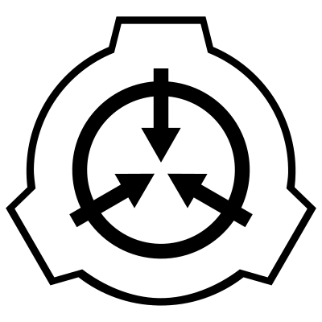

# Tarea : [ SCP ] Servidor Bifásico

Una de las misiones de la fundación SCP es la de la contención de elementos
y agentes potencialmente dañinos para la humanidad. 

Sin embargo, no son pocos los que desde la **Telaraña** intentan que el tejido 
de la realidad se resquebraje y los elementos de otras dimensiones puedan 
entrar en nuestro universo.

Desde la fundación SCP estamos contratando a los mejores técnicos para que 
nos ayuden a *Asegurar, Controlar y Proteger*. Si estás leyendo estas líneas, 
es porque un Agente de la fundación de rango Delta o superior está observándote
y espera que le ayudes.

----

Nos han llegado informes de que en la zona de Valencia Sur, cerca de la subestación
eléctrica de Paiporta, en alineación con el *Cementerio*, están ocurriendo anomalías 
eléctricas que provocan cortes intermitentes y misteriosos.

La Fundación ha decidido que debido a que esta zona está sufriendo una serie 
de ataques provenientes de varias dimensiones, va a instalar un `Servidor Bifásico` 
en uno de los puntos de control, este servidor se encargará de dar apoyo de campo
a los diferentes agentes que se enviarán a la zona en próximos dias.

Sin embargo, para garantizar que el Servidor es seguro para que los agentes 
depositen información y confíen en los datos que almacenará, vamos a realizar 
algunas configuraciones y scripts que nos ayuden a vigilar su integridad.

Recordad: *Asegurar, Controlar y Proteger* es nuestro lema.

## Paso 1:

Cread un Script que dada una IP, compruebe:

- Conectividad con la misma.
- En caso de haberla, listar si los puertos : `22` y `8080` están abiertos o no.
- Si los 2 puertos están cerrados, que pregunte si se desea hacer un **golpeo de puertos**.
- Si el usuario acepta hacerlo, le pedirá su nombre de usuario de la fundación y lo almacenará
  junto con la fecha en formato `YYYYMMDD-HHmm` de la acción en el fichero: `$HOME/.scpAgents/portKonx.log`.
- A continuación realizará el **golpeo de puertos**.

## Paso 2 :

Configurad en vuestro servidor Ubuntu el servicio `knockd` para que cuando se realice un **golpeo de puertos**
ponga en marcha el Servicio OpenSSH para permitir el login remoto y además ponga un pequeño demonio/script
en el puerto `8080` implementado con `nc` que guarda todo lo que se le envía en el fichero: `/tmp/nc-YYYYMMDD.log`. 

## Paso 3 : 

Describid los pasos realizados y subir el script, el fichero de configuración y lo que consideréis útil a
vuestro GitHub. Entregad en Aules la URL a vuestro repositorio de ASO (La creación de un `Readme.md` en la carpeta de la misión es requerido).

