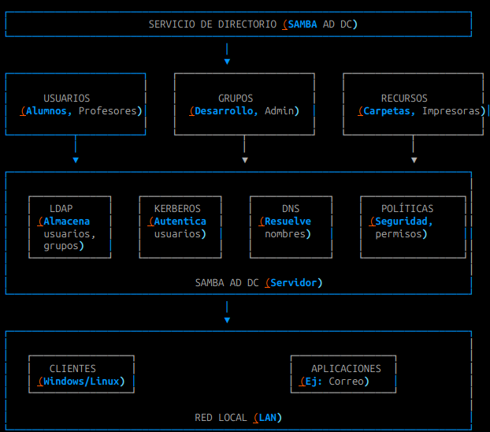

# Resultados de Aprendizaje de la Unidad

| Resultado | Descripción |
|-----------|-------------|
| RA01 |Administra el Directorio interpretando especificaciones e integrándolo en una red.|

# Criterios de Evaluación 

|ID|Descripción|
|--|----------------------------------------------|
|a|Se han identificado la función, los elementos y las estructuras lógicas del Directorio.|
|b|Se ha determinado y creado el esquema del Directorio.|
|c|Se ha realizado la instalación del Directorio en el servidor.|
|d|Se ha realizado la configuración y personalización del Directorio.|
|e|Se ha integrado el Directorio con otros servicios.|
|f|Se han aplicado filtros de búsqueda en el Directorio.|
|g|Se ha utilizado el Directorio como mecanismo de acreditación centralizada de los usuarios en una red.|
|h|Se ha realizado la configuración del cliente para su integración en el Directorio.,
|i|Se han utilizado herramientas gráficas y comandos para la administración del Directorio.|
|j|Se ha documentado la estructura e implantación del Directorio.|

---

# Funcion del Directorio

El Servicio de Directorio (Directory Service) es un componente clave en la gestión centralizada de recursos en una red, especialmente en entornos empresariales o educativos. Su función principal es organizar, almacenar y gestionar información sobre los recursos de la red, como usuarios, grupos, equipos, políticas de seguridad y permisos de acceso.

---

## Funciones clave de un servicio de directorio

### Autenticación centralizada

Valida las credenciales de usuarios (nombre de usuario y contraseña) en un solo lugar.
Ejemplo: Un usuario inicia sesión en cualquier equipo de la red usando las mismas credenciales.

### Gestión de usuarios y grupos

Permite crear, modificar y eliminar usuarios y grupos.
Facilita la asignación de permisos a recursos (carpetas, impresoras, aplicaciones).

---

## Funciones clave de un servicio de directorio II

### Control de acceso a recursos

Define qué usuarios o grupos pueden acceder a qué recursos (ej: carpetas compartidas, archivos).
Ejemplo: Solo el grupo "Profesores" puede acceder a la carpeta "Exámenes".

### Políticas de seguridad

Aplica políticas como complejidad de contraseñas, bloqueo de cuentas, o restricciones de acceso por horario.

### Replicación y redundancia

Permite tener copias del directorio en varios servidores para evitar fallos y mejorar el rendimiento.

---

# Implementación con SAMBA

SAMBA es una suite de software que permite a sistemas `Linux/Unix` emular un controlador de dominio de Windows (como Active Directory) usando el protocolo SMB/CIFS. 

Para implementar un servicio de directorio con SAMBA, se suele usar Samba4 como Controlador de Dominio (DC), que es lo que haremos en las prácticas.

---

## Componentes principales en SAMBA

### Samba AD DC

Actúa como un controlador de dominio compatible con Active Directory.
Usa `LDAP` para almacenar la información del directorio.
Usa `Kerberos` para la autenticación segura.
Usa `DNS` para la resolución de nombres en la red.

---

## Componentes principales en SAMBA II

### LDAP (Lightweight Directory Access Protocol)

Base de datos jerárquica donde se almacenan usuarios, grupos, equipos y políticas.

### Kerberos

Protocolo de autenticación que garantiza la seguridad de las credenciales.

### DNS

Resuelve nombres de dominio a direcciones IP dentro de la red.

# ¿Por qué usaremos SAMBA para un servicio de directorio?

* Compatibilidad con Windows: Permite integrar equipos Linux y Windows en el mismo dominio.
* Coste cero: SAMBA es software libre y gratuito y además está en Ubuntu Server.
* Flexibilidad: Se puede personalizar según las necesidades de la red.
* Escalabilidad: Adecuado para redes pequeñas, medianas y grandes.

---

# Esquema del servicio

\

---
