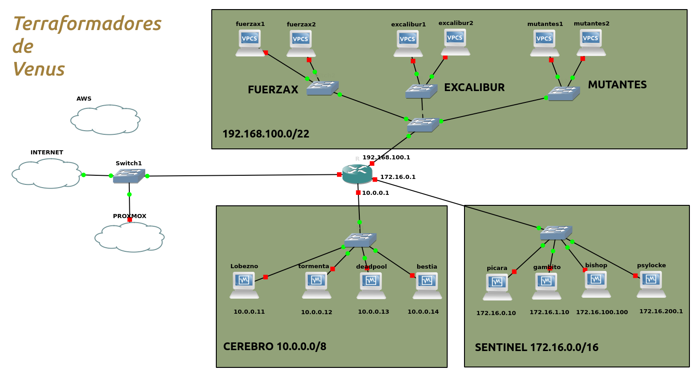

### **Arracamos con la empresa**

1. **Introducción a la Empresa:**
   - Conocer la misión y visión de Terraformadores de Venus.
   - Familiarizarse con los fundadores, Stan Lee y Jack Kirby, y su pasión por las tecnologías disruptivas.

2. **Presentación del Equipo:**
   - Conocer a tus compañeros de equipo: Charles Xavier (Profesor X), Jean Grey (Marvel Girl), Beast (Hank McCoy) y Angel (Warren Worthington III).
   - Entender los roles y habilidades de cada miembro del equipo.
   - Conoceros a vosotr@s los futuros x-men y x-women

3. **Logo para la empresa:**
   - Está es una empresa nueva y necesita de vuestra creatividad para asignarle un logo. Propondéis un logo y realizaremos un concurso para su elección.
     
4. **Configuración Inicial:**
   - Empezaréis a crear la infraestreuctura de terraformadoes de Venus utilizando el increible software GNS3

  

### Misión 1: Configuración Infraestructura

Bienvenidos, terraformadores. En esta primera misión, vuestro objetivo será configurar el servidor Lobezno con un sistema operativo Ubuntu Server y preparar el equipo Mutante 1 como un terminal listo para la acción. Este terminal será un contenedor Docker con vuestras utilidades de red favoritas, y recibirá una IP adecuada a través del DHCP del router.

Ambos equipos, Lobezno y Mutante 1, deberán tener acceso a internet. Además, el servidor Lobezno será accesible por **SSH** desde el equipo Mutante 1.