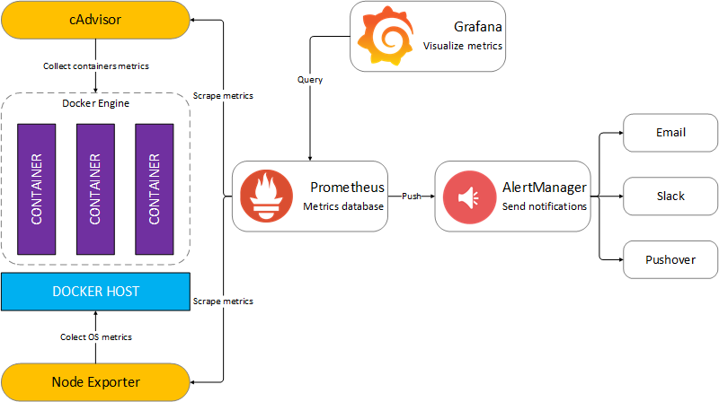

**Misión: Monitorización de Servidores Web con Contenedores Docker**

### Contexto
La empresa *Terraformadores de Venus* ha recibido una nueva solicitud por parte de una compañía especializada en comercio electrónico, **EcomTech Solutions**. Esta empresa gestiona múltiples servidores web y necesita una **solución de monitorización eficiente** para garantizar el rendimiento óptimo de su infraestructura. Su principal preocupación es la **detección temprana de fallos y la optimización de recursos**, evitando tiempos de inactividad que podrían afectar a sus clientes.

Nuestra tarea consiste en implementar una solución basada en **Prometheus, Grafana y cAdvisor** para recopilar métricas en tiempo real y visualizar el estado de los contenedores Docker en los que se ejecutan sus aplicaciones web.
Además para que el servico sea lo más rápido y eficiente queremos configurar un servidor de mensajería privado para que envie alertas a los administradores del sistema si se produce alguna alerta en el servidor

**Crearemos en la fase de desarrollo para probar el sistema una instancia en AWS sobre la que desplegaremos varios contenedores apache o nginx y desplegaremos la siguiente arquitectura.** 

fuente: https://nontster.medium.com/line-notify-gateway-2-f117c20c6f62

---

### Objetivos
1. **Implementar un entorno de monitorización** para servidores web con múltiples contenedores Docker.
2. **Configurar Prometheus** para recopilar métricas de los contenedores.
3. **Configurar cAdvisor y Node Exporter** para obtener datos detallados sobre uso de CPU, memoria y almacenamiento.
4. **Integrar Grafana** para visualizar la información de manera intuitiva y generar paneles de control útiles.
5. **Implementar un sistema de mensajería con Matrix** para el envío de alertas automáticas al administrador del sistema.

---

### Requisitos Técnicos
Para llevar a cabo esta implementación, utilizaremos las siguientes tecnologías:
- **Docker**: Para gestionar los servicios y contenedores web.
- **Prometheus**: Para recopilar y almacenar métricas.
- **cAdvisor**: Para obtener datos en tiempo real sobre los contenedores Docker.
- **Node Exporter**: Para monitorear recursos del sistema host.
- **Grafana**: Para visualizar las métricas en paneles interactivos.
- **Matrix (Synapse)**: Para crear un servidor de mensajería seguro y descentralizado.

---

### Pasos de Implementación
Empezar montando el servidor a monitorizar. Crear el servidor y desplegar la web de la empresa, junto con múltiples contenedores Docker que representen los distintos servicios web ofrecidos.

1. **Desplegar el servivo de mmonitorización`docker-compose.yml`** para desplegar los siguientes servicios:
   - Un servidor web en contenedores Docker.
   - Node Exporter: Se instala en el servidor para recolectar métricas del sistema operativo (como uso de CPU, memoria, disco, etc.).
   - cAdvisor: Se instala como un contenedor Docker y se encarga de recolectar métricas de todos los demás contenedores que están corriendo en el servidor.
   - Prometheus: Se configura para que recolecte las métricas de Node Exporter y cAdvisor, y las almacene en una base de datos.
   - Grafana: Se configura para conectarse a Prometheus y mostrar las métricas en gráficos y dashboards personalizados.

1. **Desplegar el servicicio de mensajería** `docker-compose.yml`:
   

### Alertas.
- Crear una sala en Matrix:
- Crear un usuario administrador del sistema.
- Crear una sala de alertas.
- Configurar el envío automático de mensajes cuando se dispare una alerta. 
---

>   AYUDA 
>   **https://www.webhi.com/how-to/docker-monitoring-using-prometheus-cadvisor-node-exporter-grafana/**
