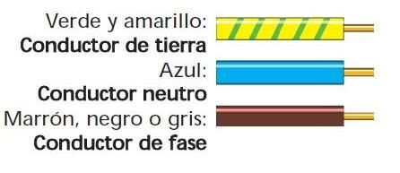

# El desafío ecosocial de consumir menos energía como oportunidad profesional en el ámbito de la sostenibilidad

La crisis ambiental global ha puesto de manifiesto la urgencia de pasar hacia modelos productivos y de consumo más sostenibles. 

En este contexto, la **eficiencia energética** se ha convertido en un pilar estratégico, no solo por su impacto ambiental, sino también por su capacidad para generar ahorros económicos y mejorar la competitividad de las empresas. Para los futuros profesionales, ya sea en pymes, consultorías ambientales o grandes corporaciones, entender y aplicar medidas de ahorro energético será una competencia clave, pues las bases técnicas de las instalaciones eléctricas —tanto en hogares como en empresas— son las mismas, y las oportunidades de mejora, *escalables*.

El reto ecosocial de reducir el consumo energético va más allá del ámbito doméstico: en el entorno laboral, implica optimizar procesos, seleccionar tecnologías eficientes y diseñar estrategias que minimicen el desperdicio de recursos. Esto requiere un conocimiento sólido de cómo funcionan las instalaciones, los equipos y los sistemas de gestión energética, así como la capacidad para identificar ineficiencias y proponer soluciones viables. Por ejemplo, la auditoría energética, la implementación de energías renovables o la sensibilización de equipos de trabajo son áreas donde los profesionales pueden marcar la diferencia, alineando la sostenibilidad con la rentabilidad.

En el día a día de una empresa, acciones como la monitorización de consumos, el mantenimiento preventivo de maquinaria, la elección de iluminación LED, la optimización de horarios de producción o la adopción de criterios de economía circular, no solo reducen la huella ambiental, sino que también mejoran la imagen corporativa y cumplen con normativas cada vez más exigentes. Además, en un mercado laboral en transformación, las habilidades para gestionar la energía de manera inteligente son un valor añadido, ya que permiten a las organizaciones adaptarse a las demandas de clientes, inversores y regulaciones.

En definitiva, el ahorro energético es una responsabilidad profesional que comienza por aplicar en el ámbito personal lo aprendido en el aula, y que luego se proyecta en el diseño de soluciones innovadoras para empresas. Dominar estos conceptos no solo contribuye a la sostenibilidad del planeta, sino que abre puertas a oportunidades laborales en un sector en crecimiento, donde la eficiencia y la responsabilidad ambiental son ya requisitos imprescindibles.

# Energia Eléctrica 

Dentro de todas las energías que la Sociedad consume, la que más nos afecta dentro de la familia de Informática
es la energía *eléctrica*. Esta energía, que está tomando cada vez más protagonismo en nuestras sociedades, es 
uno de los pilares básicos de la infraestructura de energías que nos rodean.

Sin embargo, es común desconocer cómo funciona en realidad la red eléctrica y cómo funcionan los diferentes nodos
de la misma. Para poder realizar estudios y comprender *qué está ocurriendo realmente*, es necesario que se conozcan 
las bases, así cómo para desarrollar un espíritu crítico ante situaciones que aunque forman parte de nuestra vida 
diaria, se asumen como *magia*.

A nivel de sostenibilidad, lo primero que se puede hacer es : *Consumir menos*, y para ello debemos de tener 
los conocimientos de cómo se consume y cómo funciona (a nivel básico) la electricidad en nuestros hogares...
¿Pero cómo llega la electricidad a nuestras casas?. 

La generación y el transporte de la electricidad que producimos es un proceso que incluye una serie de pasos:

## Generación de electricidad

Fuentes de energía primaria: La electricidad no se encuentra libremente en la naturaleza en grandes cantidades 
utilizables. Por lo tanto, debemos convertir otras formas de energía en electricidad. 
Esto se hace a partir de diversas fuentes primarias, que pueden ser:

- *Fuentes no renovables*: Combustibles fósiles (carbón, petróleo, gas natural) y energía nuclear (uranio). 
En estas plantas, se quema el combustible o se realiza la fisión nuclear para generar calor. 
Este calor se utiliza para hervir agua y producir vapor a alta presión.

- *Fuentes renovables*: Energía hidráulica (agua en movimiento), eólica (viento), solar (radiación solar), 
geotérmica (calor interno de la Tierra) y biomasa (materia orgánica). 
Estas fuentes aprovechan fenómenos naturales o recursos que se reponen.

## Transformación de energía 

La mayoría de las centrales eléctricas utilizan turbinas conectadas a generadores eléctricos.

El vapor a alta presión (en el caso de fuentes térmicas) o la fuerza del agua o el viento (en el caso de fuentes renovables como la hidroeléctrica o la eólica) hacen girar las palas de la turbina.

La turbina, a su vez, hace girar un generador. 
Dentro del generador, un conjunto de bobinas de cable conductor giran dentro de un campo magnético (o viceversa). 
Este movimiento relativo entre el campo magnético y los conductores induce un flujo de electrones, creando así una corriente eléctrica (este principio se conoce como la ley de Faraday de la inducción electromagnética).

En el caso de la energía solar fotovoltaica, las placas solares convierten directamente la luz solar en electricidad mediante el efecto fotovoltaico.

## Transporte de electricidad

Una vez generada la electricidad en las centrales, necesita ser transportada hasta los puntos de consumo (hogares, industrias, etc.). Este transporte se realiza a través de una red compleja conocida como la red eléctrica o sistema de transmisión y distribución.

Para que esto ocurra ha de hacerse algunos cambios en la energía eléctrica para facilitar su traslado.

### Aumento de voltaje

La electricidad generada en las centrales tiene un voltaje relativamente bajo. Para poder transportarla eficientemente a largas distancias, se utiliza un transformador elevador en la subestación de la central. 

Este transformador aumenta el voltaje a niveles muy altos (alta tensión, como 132 kV, 220 kV o incluso superiores). Esto se hace para minimizar las pérdidas de energía por efecto Joule (calentamiento de los cables debido a la resistencia eléctrica) durante la transmisión. 

La potencia eléctrica (P) es el producto del voltaje (V) y la corriente (I) : $P = V * I$. 

Para transmitir la misma cantidad de potencia a un voltaje más alto, se requiere una corriente más baja, lo que reduce las pérdidas ( P perdidas​ = $I 2 * R$, donde $R$ es la resistencia del cable).

### Transmisión de alta tensión

La electricidad de alto voltaje se transporta a través de líneas de transmisión de alta tensión, que son los grandes cables sostenidos por torres metálicas que vemos en el paisaje. Estas líneas pueden recorrer cientos o incluso miles de kilómetros.

### Subestaciones de reducción 

A medida que la electricidad se acerca a las áreas de consumo, llega a subestaciones de reducción. En estas subestaciones, se utilizan transformadores reductores para disminuir progresivamente el voltaje a niveles más seguros y adecuados para la distribución local (media tensión, como 20 kV o 15 kV).

### Distribución de media y baja tensión

Desde las subestaciones de reducción, la electricidad se distribuye a través de líneas de distribución de media tensión que llegan a los barrios y zonas industriales. Finalmente, cerca de los puntos de consumo, otros transformadores (a menudo montados en postes o en cabinas) reducen el voltaje a baja tensión (como *230V* en España) para su uso seguro en hogares y negocios.

### Conexión al consumidor

La electricidad de baja tensión llega a los hogares y edificios a través de cables subterráneos o aéreos, pasando por un contador que mide el consumo de energía. Desde el contador, la electricidad se distribuye a través del cuadro eléctrico de la vivienda a los diferentes enchufes y puntos de luz. En esta unidad veremos cómo funciona (a nivel básico) y aprenderemos a utilizarlo.

\newpage
# Unidades Eléctricas Comunes en Instalaciones de Baja Tensión

Cuando se trabaja con electricidad, debemos entender las unidades eléctricas que se utilizan. Estas unidades permiten medir diferentes aspectos de la electricidad, como la energía, la potencia y la corriente. 
A continuación, vamos a ver algunas de las unidades eléctricas más comunes en instalaciones domésticas.

1. Voltio ($V$)

    - Definición: El voltio es la unidad de medida de la tensión eléctrica. Representa la diferencia de potencial eléctrico entre dos puntos en un circuito.
    - Uso en el hogar: La tensión estándar en la mayoría de los hogares es de 230V en corriente alterna en Europa y 120V en América del Norte.

2. Amperio ($A$)

    - Definición: El amperio es la unidad de medida de la corriente eléctrica. Representa la cantidad de carga eléctrica que fluye a través de un conductor en un segundo.
    - Uso en el hogar: Los circuitos eléctricos están diseñados para manejar una cierta cantidad de amperios. Por ejemplo, los circuitos de iluminación son típicamente de 10A, mientras que los de enchufes pueden ser de 16A.


3. Vatio ($W$)

    - Definición: El vatio es la unidad de medida de la potencia eléctrica. Se define como la cantidad de energía que se utiliza por unidad de tiempo.
    - Uso en el hogar: Los dispositivos eléctricos como bombillas, electrodomésticos y maquinaria tienen su potencia indicada en vatios. Por ejemplo, una bombilla puede consumir 10W, mientras que un microondas puede consumir entre 800W y 1200W.


4. Kilovatio ($kW$)

    - Definición: El kilovatio es igual a 1000 vatios. Se utiliza comúnmente para describir la potencia de electrodomésticos más grandes.
    - Uso en el hogar: Por ejemplo, la capacidad de una calefacción eléctrica podría ser de 2kW, indicando que consume 2000 vatios de potencia.


5. Kilovatio hora ($kWh$)

    Definición: El kilovatio hora es la unidad de medida de la energía eléctrica. Representa la cantidad de energía utilizada durante una hora por un dispositivo que consume 1kW de potencia.
    Uso en el hogar: Esta es la unidad que aparece en la factura de electricidad. Por ejemplo, si un electrodoméstico consume 2kW y funciona durante 3 horas, habrá utilizado 6 kWh de energía.


6. Ohmio ($O$)

    Definición: El ohmio es la unidad de medida de la resistencia eléctrica. Indica la oposición al flujo de corriente en un circuito.
    Uso en el hogar: Cada conductor y dispositivo en la instalación eléctrica tiene cierta resistencia, lo que puede afectar la cantidad de corriente que fluye.


7. Faradio ($F$)

    Definición: El faradio es la unidad de medida de la capacitancia. Indica la capacidad de un capacitor para almacenar carga eléctrica.
    Uso en el hogar: Aunque no es tan común en términos de aplicaciones domésticas, se utiliza en circuitos electrónicos y dispositivos informáticos
    que son comunes en nuestro trabajo como Técnicos.

\newpage

# Electricidad de Baja Tensión

Cuando se habla de la instalación de electricidad que llega a nuestras casas, dos componentes clave son *la fase y el neutro*. Comprender su función nos ayudará a tener una mayor claridad sobre cómo fluye la electricidad y cómo podemos utilizarla de manera más segura y eficiente.

## La Fase

La fase es el conductor a través del cual fluye la corriente eléctrica hacia un dispositivo o carga. Es el hilo que transporta la electricidad desde la red hasta nuestros electrodomésticos y otros dispositivos.

* **Voltaje**: La fase transporta un voltaje alterno que varía con el tiempo. En Europa, la tensión de la fase suele ser de 230V en corriente alterna (CA).
* **Trabajo eléctrico**: La fase es la que "hace el trabajo" al permitir que la corriente fluya hacia los dispositivos eléctricos. Cuando conectamos un dispositivo a la fase, permite que este funcione.


## El Neutro

El neutro es el conductor que completa el circuito eléctrico. Su función principal es proporcionar un camino de regreso para la corriente eléctrica después de que ha pasado a través de un dispositivo o carga.

**Potencial eléctrico**: El neutro se encuentra generalmente a un potencial eléctrico *cercano a 0V*. Esta característica es esencial para la seguridad, ya que evita diferencias de potencial peligrosas.

Equilibrio en el circuito: La conexión del neutro es fundamental para garantizar que la corriente vuelva a la fuente de alimentación. Sin un buen *retorno a tierra* a través del neutro, pueden ocurrir problemas de funcionamiento y seguridad.


## Funcionamiento del Circuito

El funcionamiento básico del circuito eléctrico en un hogar incluye:

* **Conexión**: Cuando se enciende un dispositivo, la corriente fluye desde la fase a través del dispositivo (ej. una lámpara o nuestro ordenador).
* **Carga**: Al pasar por el dispositivo, la corriente realiza *trabajo*: enciende la lámpara, mueve el motor de un electrodoméstico, etc.
* **Retorno**: Después de que la electricidad ha pasado por el dispositivo, fluye a través del neutro de vuelta a la fuente de alimentación, completando el circuito.


## Importancia de la Tierra

Adicionalmente, en la instalación eléctrica moderna, debe haber un tercer conductor llamado **tierra**:

* **Protección**: La tierra proporciona una vía de escape para la corriente en caso de fallos, protegiéndonos a las personas de descargas eléctricas y evitando daños en los aparatos eléctricos.
* **Seguridad**: En caso de un cortocircuito, la tierra ayuda a desactivar el sistema automáticamente.

## Colores de los Cables

Aunque son muchísimo más fáciles de identificar que los de los *Cables Ethernet*, es necesario que se tengan claros los colores de los cables para manipular, diagnosticar averías, etc.

\


# Cuadro eléctrico

En el cuadro eléctrico de las casas, oficinas, etc. se encuentran donde marca la Normativa (normalmente), y es importante que 
conozcáis que existe normativa para las Instalaciones Eléctricas y que puede ser consultada de manera pública.

Tal y como pone en [ BOE - Ultima Actualización 03/04/2025 ](https://www.boe.es/eli/es/rd/2002/08/02/842/con/20250403) :

```verbatim

Los dispositivos generales de mando y protección, se situarán lo más cerca posible del
punto de entrada de la derivación individual en el local o vivienda del usuario. En viviendas y
en locales comerciales e industriales en los que proceda, se colocará una caja para el
interruptor de control de potencia, inmediatamente antes de los demás dispositivos, en
compartimento independiente y precintable. Dicha caja se podrá colocar en el mismo cuadro
donde se coloquen los dispositivos generales de mando y protección.
En viviendas, deberá preverse la situación de los dispositivos generales de mando y
protección junto a la puerta de entrada y no podrá colocarse en dormitorios, baños, aseos,
etc. En los locales destinados a actividades industriales o comerciales, deberán situarse lo
más próximo posible a una puerta de entrada de éstos.

```

Aprender a leer este tipo de documentación y a manejarse en ella son destrezas necesarias para nuestra vida profesional, 
aunque en este caso es también muy importante para nuestra vida personal, ya que las averías eléctricas son comunes 
y debemos saber como funciona (a nivel básico).

## Dispositivos Generales de Mando y Protección

Vamos a ver una breve descripción de algunos de los elementos que aparecerán en nuestros
cuadros eléctricos.

```verbatim
Los dispositivos generales e individuales de mando y protección serán, como mínimo:

–Un interruptor general automático de corte omnipolar, que permita su accionamiento manual y que esté dotado de elementos de protección contra sobrecarga y cortocircuitos. Este interruptor será independiente del interruptor de control de potencia.
–Un interruptor diferencial general, destinado a la protección contra contactos indirectos 
de todos los circuitos; salvo que la protección contra contactos indirectos se efectúe mediante otros dispositivos de acuerdo con la ITC-BT-24.
–Dispositivos de corte omnipolar, destinados a la protección contra sobrecargas y cortocircuitos de cada uno de los circuitos interiores de la vivienda o local.
–Dispositivo de protección contra sobretensiones, según ITC-BT-23, si fuese necesario.
```

## Esquema Eléctrico Básico

A continuación se muestra un pequeño esquema eléctrico doméstico:

\\

Y este con imágenes:

\\
